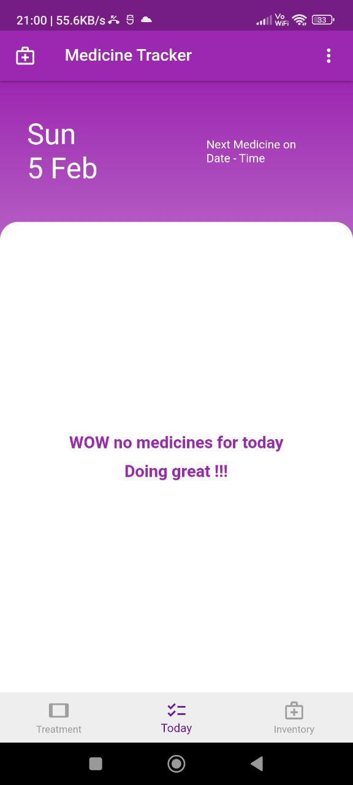
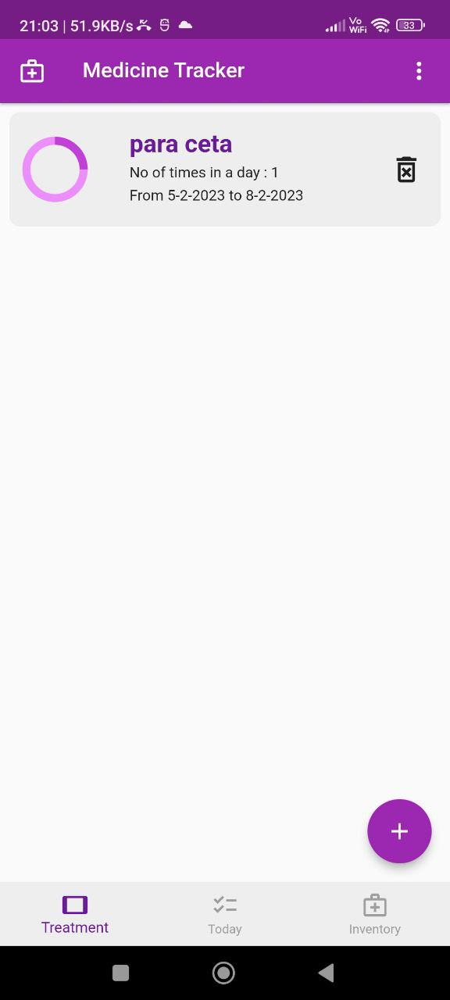

# medtrack

This project is about a medicine reminder application made in flutter.

where you can :
    - Track inventory of medicine.
    - Mark and schedule all the medicines needed to take.
    - Get udates of which medicine need to take today.
    - notification and alarm for medicine timings (feature not added yet).
    
    

  
  

